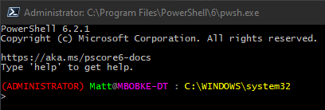

# PowerShell Environment Setup



## Quick Installation

```powershell
git clone https://github.com/mcbobke/PowerShell-Environment.git
Set-Location -Path '.\PowerShell-Environment'
& .\Install-Profile.ps1
```

## Features

* Installs profile script and custom functions for all users/all hosts on the client machine
* Windows PowerShell 5.1 and Core Compatible
* Fun colored prompt


## WIP Items

### Configure-Windows10.ps1

A script that auto-configures a freshly-imaged Windows 10 machine to my liking.

To-Dos:

* Ensure that any critical PowerShell modules get installed
* Check for any missing Chocolatey packages that I need
* Create "C:\Users\$Env:USERNAME\Documents\Git" folder and clone this repo into it
* Execute 'Install-Profile.ps1'
* Install SettingsSync VSCode extension via the command line so that I can just open VSCode and connect to SettingsSync right away
* Set taskbar shortcuts if possible
* Remove any bloatware
* More to come, this is a living script
