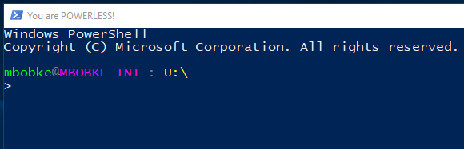
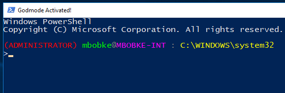

# Powershell Environment Setup

### Run as Non-Administrator



### Run as Administrator



### Installation

```
git clone https://github.com/mcbobke/Powershell-Scripting.git
cd ".\Powershell-Scripting\EnvironmentSetup"
powershell.exe -ExecutionPolicy Bypass -File .\Invoke-EnvironmentSetup.ps1
```

To install Windows OpenSSH and WinDbg alongside the profile (you can also leave either of them out):

```
powershell.exe -ExecutionPolicy Bypass -File .\Invoke-EnvironmentSetup.ps1 -InstallSSH -InstallWinDbg
```

There are also batch script installers for each possible combination. Make sure to right-click and run as admin.

### Uninstallation

```
powershell.exe -ExecutionPolicy Bypass -File .\Invoke-EnvironmentTeardown.ps1
```

Or run the uninstall batch script.

### Features

* Installs profile script and custom functions for all users/all hosts on the client machine
* Custom Powershell shell window with a color-coded prompt and environment path extended to include OpenSSH/WinDbg
* Optionally installs Windows OpenSSH [using Microsoft's method](https://github.com/PowerShell/Win32-OpenSSH/wiki/Install-Win32-OpenSSH)
* Optionally installs WinDbg (https://developer.microsoft.com/en-US/windows/downloads/windows-10-sdk)
* Uninstall script for full environment included - automatically run by Invoke-EnvironmentSetup if another version of the environment is installed